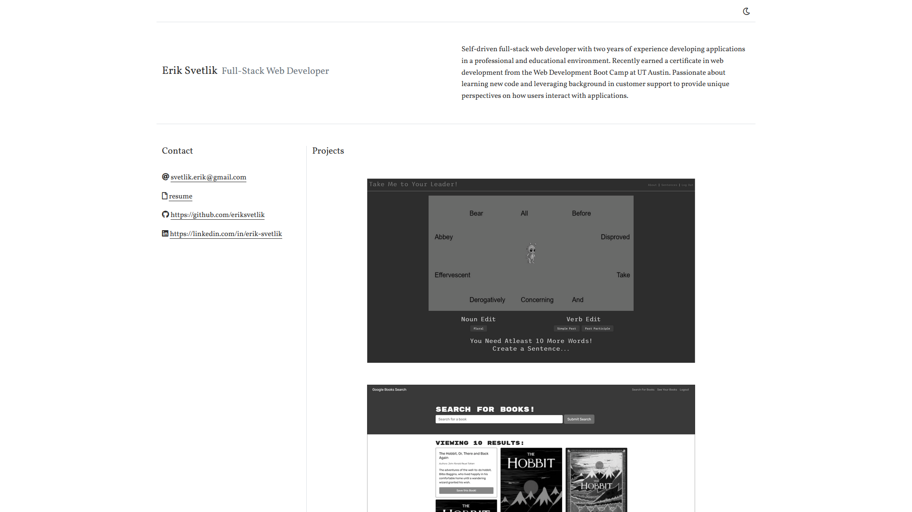

# Description

My personal portfolio.

Users can select a project image to bring up info on that project, as well as the deployment link and GitHub repository link.

Users can also select the moon icon in the top-right of the page to enable dark mode.

HTML | CSS | Bootstrap | Javascript

# Screenshot

# Link

(https://eriksvetlik.github.io/portfolio/)
